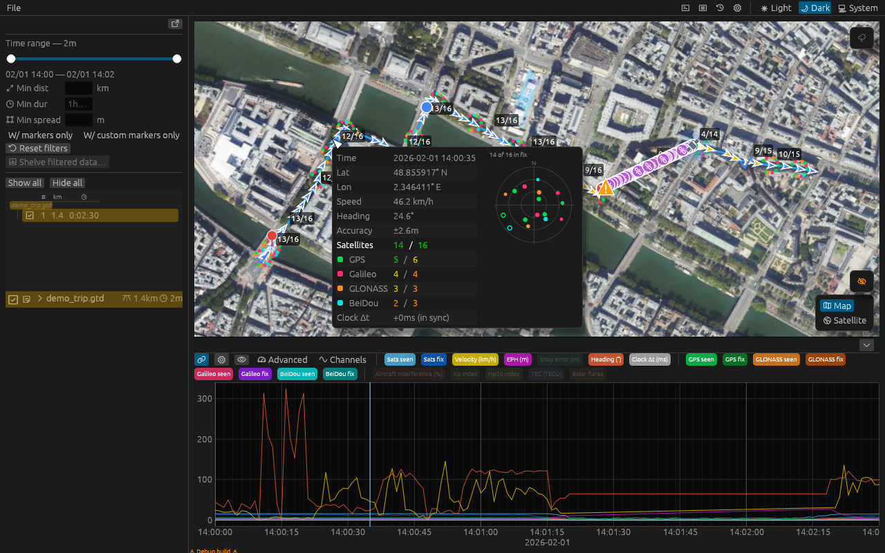
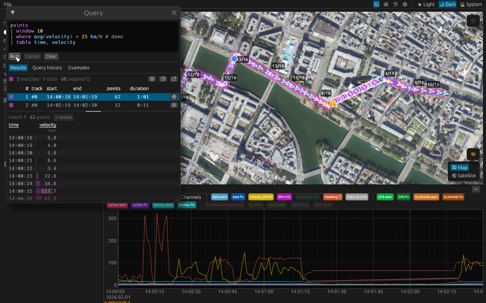

# GeoTrace

> [!NOTE]
> **Beta** - expect minor issues/quirks and frequent updates.

GeoTrace is a desktop application for inspecting GPS/GNSS navigation data.
It reads `.gtd` recording files and renders position traces, per-satellite signal quality, derived analysis metrics, and interference data on an interactive map and time-series plot.

Everything in a recording is drawn as recorded. Outliers, gaps, and bad fixes are surfaced.
Narrowing the view is done through explicit steps, such as a time span filter, per-category visibility toggles, a query, etc.



_(offline map) A short ride with multi-constellation satellite data, custom and event markers, and a 59-second tunnel fix-loss followed by gradual signal reacquisition.
The screenshot is the UI snapshot test baseline (with map tiles off), so it always matches the current build._

## Features

**Map** - OpenStreetMap and satellite basemaps, several recordings at once, drag-and-drop loading.
Track points, markers, satellite labels, and sky glyphs are drawn as vector meshes and each category can be hidden on its own.

**Time-series plot** - velocity, heading, EPH, clock delta, satellites seen and in fix per constellation, and the derived analysis metrics, plus any ad-hoc sensor channels the recording carries.
Hovering cross-highlights with the map.

**Sky plot** - polar view of the satellites in a fix, with a signal-strength heat field.
Shown per point, as a whole-track overlay on the map, and as a scrubbable trails window replaying every satellite's path across the sky.

**Analysis** - satellite utilization, loss of lock and slip rate, and clock offset excursions, computed over configurable parameters and surfaced as plot metrics and map markers.

**GNSS interference** - aircraft-reported interference from gpsjam.org drawn as a map layer and available as a metric.
Days are archived locally as they are fetched, so they stay available offline.

**Snap to road** - match a track against the OpenStreetMap road network with Valhalla.
The matched geometry draws on the map and the per-point distance to it becomes a metric.
Nothing is uploaded without consent, and you can optionally route requests to a custom server.

**History** - every loaded recording is stored in a local database and can be re-opened without the original file.

## Query language

A small declarative pipeline for ad-hoc analysis, written in the query window.
Matches are drawn on the map, listed in a results table, and cross-highlighted on the plot.
Expressions are unit-checked before a run, and the editor autocompletes and documents every construct as you type.

```
points
| window 10
| where spread(heading) <= 10 deg
    and avg(accel) >= 0.3 m/s2
    and avg(velocity) > 30 km/h
| draw
| table time, velocity, heading, accel
```

Every plot metric is queryable, along with the recording's own sensor channels.
A query can halo its matches, keep only them, or hide them.



## Install

> [!NOTE]
> Installers and packages are published with each tagged release.

GeoTrace is a desktop app for Linux, macOS, and Windows (x86-64 and ARM64).

Linux / macOS (shell):

```sh
curl --proto '=https' --tlsv1.2 -LsSf https://github.com/CramBL/geotrace/releases/latest/download/geotrace-installer.sh | sh
```

Windows (PowerShell):

```powershell
irm https://github.com/CramBL/geotrace/releases/latest/download/geotrace-installer.ps1 | iex
```

Homebrew (Linux / macOS):

```sh
brew install CramBL/homebrew-tap/geotrace
```

Windows installer: download the `.msi` for your architecture from the [latest release](https://github.com/CramBL/geotrace/releases/latest).

GeoTrace checks for a newer release on startup and offers to update.
Installs from the shell/PowerShell installer update in place, any other install is pointed at the downloads page.
`geotrace --update` does the same from the terminal.
The check can be turned off under Settings.

> [!NOTE]
> Releases are currently **unsigned**.
> On macOS, the first launch needs right-click &rarr; **Open** (or `xattr -d com.apple.quarantine /path/to/geotrace`).
> On Windows, SmartScreen shows **More info &rarr; Run anyway**.

## Network access

Map tiles and the update check are the only requests made on their own.
The interference layer and snap to road reach out for their own data, both against a configurable host, and snap to road uploads track coordinates only after explicit consent.

## SDKs

> [!NOTE]
> SDK packages are published on their own release cadence, separate from the app.

GeoTrace defines an open binary format (`.gtd`) for storing navigation recordings.
SDKs are available so you can produce `.gtd` files from any data source and open them in GeoTrace.

A recording carries nav fixes, satellite reports, annotations, event markers, ad-hoc sensor channels, and recording metadata.

All SDKs are MIT licensed and can be embedded in proprietary applications.

### Rust SDK

```sh
cargo add geotrace-sdk
```

```rust
use geotrace_sdk::{Angle, DateTime, NavFileBuilder, NavFix, Utc};

let t = "2024-01-15T09:00:00Z".parse::<DateTime<Utc>>()?;
let mut recorder = NavFileBuilder::new().open();
// add() dispatches by type: NavFix, SatelliteReport, Annotation, or EventMarker.
recorder.add(
    NavFix::builder()
        .gps_time(t)
        .lat(Angle::degrees(51.5074))
        .lon(Angle::degrees(-0.1278))
        .build(),
);
let nav_file = recorder.finish()?;
nav_file.write_to_file("track.gtd")?;
```

Examples: [`docs/sdk/rust.md`](docs/sdk/rust.md).

### C SDK

A C99 API over the `.gtd` encoder/decoder, for embedding in any language with a C FFI.
Install (Homebrew, prebuilt archive, or source) and examples: [`docs/sdk/c.md`](docs/sdk/c.md).

### C++ SDK

A header-only C++17 wrapper over the C SDK, with RAII types and range-based iteration.
Install and examples: [`docs/sdk/cpp.md`](docs/sdk/cpp.md).

### Python SDK

```sh
uv add geotrace-sdk
# or: pip install geotrace-sdk
```

```python
from datetime import UTC, datetime
from geotrace_sdk import NavFileBuilder, NavFix

recorder = NavFileBuilder()
recorder.add(NavFix(lat=51.5074, lon=-0.1278, gps_time=datetime(2024, 1, 15, 9, 0, 0, tzinfo=UTC)))
recorder.finish().write_to_file("track.gtd")
```

Examples: [`docs/sdk/python.md`](docs/sdk/python.md).

## Development

Use [`just`](https://just.systems) to run common tasks:

```
just --list
```

Before committing, run `just ci` and fix any errors or warnings.

See [`CODE_STYLE.md`](CODE_STYLE.md) and [`DESIGN.md`](DESIGN.md) for project conventions.

## License

GeoTrace uses a split-licensing model.

- **Core application and internal crates** - AGPL-3.0.
  See [`LICENSE`](./LICENSE).
- **SDKs** (`geotrace-sdk`, C SDK, C++ SDK, Python SDK) - MIT.
  See [`sdk/rust/geotrace-sdk/LICENSE`](sdk/rust/geotrace-sdk/LICENSE).
  The SDKs can be embedded in proprietary applications without triggering the AGPL terms of the core application.

Map tiles and road-network matching build on [OpenStreetMap](https://www.openstreetmap.org/copyright) data.
Interference data is published by [gpsjam.org](https://gpsjam.org) from [adsbexchange.com](https://adsbexchange.com) reports.
